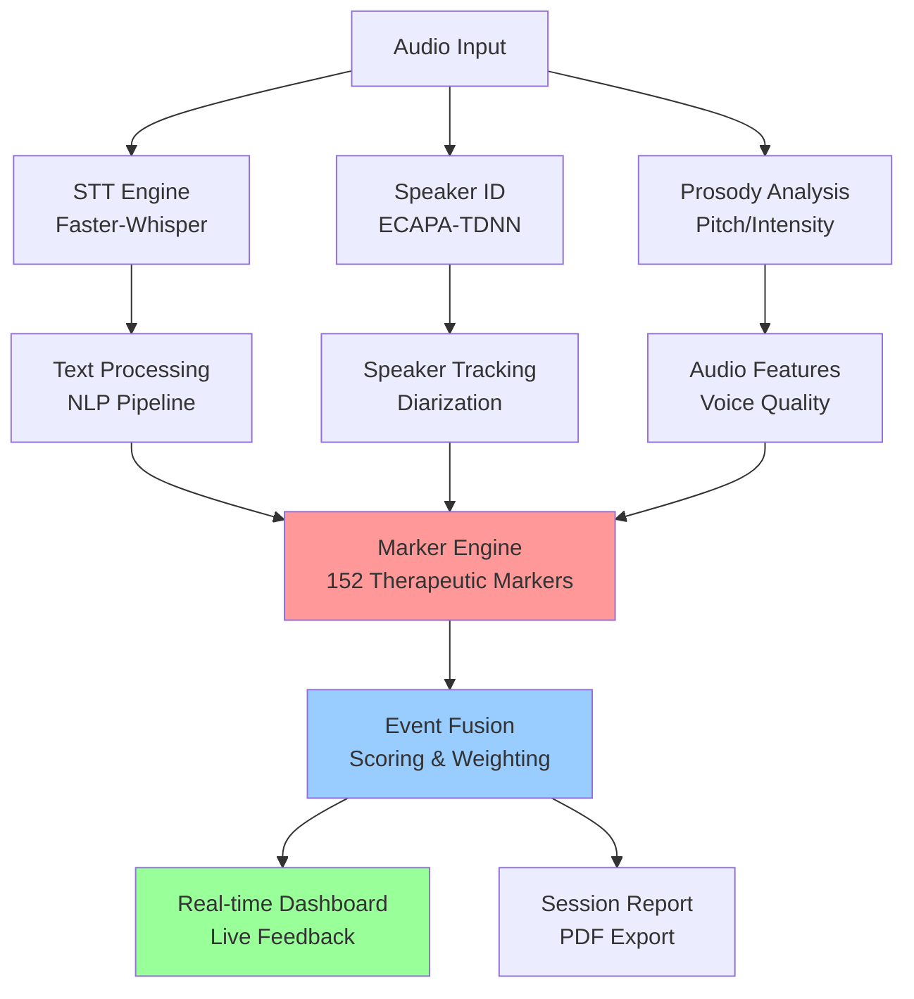

# 🎯 TransRapport - AI-Powered Therapy Analysis System

> **Vollständig offline lauffähiges Therapie-Analyse-System mit 152 validierten therapeutischen Markern**

[](https://github.com/DYAI2025/T-Rapport_full_offline)
[](https://python.org)
[](https://creativecommons.org/licenses/by-nc-sa/4.0/)
[](/)

TransRapport ist ein intelligentes System zur automatisierten Analyse von Therapiegesprächen. Es kombiniert modernste KI-Technologien mit klinisch validierten therapeutischen Markern, um Therapeuten bei der Dokumentation und Reflexion zu unterstützen - **komplett offline und DSGVO-konform**.

---

## ✨ Hauptfeatures

### 🔊 **Live Audio-Analyse**
- **Echtzeit-Transkription** mit Faster-Whisper (CT2-optimiert)
- **Sprecher-Identifikation** via ECAPA-TDNN Embeddings
- **Prosody-Analyse** (Tonfall, Pausen, Betonungen)
- **Emotion-Detektion** aus Audio-Features

### 🎯 **Therapeutische Marker**
- **152 validierte Marker** nach LEAN.DEEP 3.4 Schema
- **4-Level Hierarchie**: ATO (Atomic) → SEM (Semantic) → CLU (Cluster) → MEMA (Meta-Marker)
- **Klinische Relevanz**: Bindungsstile, Abwehrmechanismen, Durchbrüche
- **Echtzeitdetektion** während des Gesprächs

### 🔒 **Datenschutz & Sicherheit**
- ✅ **100% Offline-Betrieb** - keine Cloud-Verbindung nötig
- ✅ **DSGVO-konform** - alle Daten bleiben lokal
- ✅ **Verschlüsselte Speicherung** aller Session-Daten
- ✅ **Keine Telemetrie** oder externe API-Aufrufe

### 🖥️ **Flexible Deployment-Optionen**
- **Desktop-App** (PyWebview) für Einzelpraxen
- **Web-Interface** (FastAPI + Static Frontend) für Teams  
- **Docker/K8s** für Enterprise-Deployment
- **API-Integration** für bestehende Praxis-Software

---

## 🚀 Quick Start

### Option 1: Desktop-App (Empfohlen für Einzelnutzer)
```bash
git clone https://github.com/DYAI2025/T-Rapport_full_offline.git
cd T-Rapport_full_offline
pip install -r requirements.lock
python desktop/main_desktop.py
```

### Option 2: Web-Server (Empfohlen für Teams)
```bash
git clone https://github.com/DYAI2025/T-Rapport_full_offline.git
cd T-Rapport_full_offline
pip install -r requirements.lock
python app/ui_main.py
# → Öffnen Sie http://localhost:8765 im Browser
```

### Option 3: Docker (Empfohlen für Production)
```bash
docker run -d \
  --name transrapport \
  -p 8765:8765 \
  -v ./sessions:/app/data \
  transrapport/server:3.4
```

> ⚠️ **Wichtig**: Für die erste Nutzung müssen die AI-Modelle heruntergeladen werden (~2GB). Dies geschieht automatisch beim ersten Start oder manuell mit `python tools/download_models.py`.

---

## 📊 System-Architektur



### 🧠 **LEAN.DEEP 3.4 Marker-Hierarchie**

| Level | Beschreibung | Beispiele | Count |
|-------|--------------|-----------|-------|
| **ATO** | Atomare Ereignisse | Lachen, Seufzer, Pausen | 67 |
| **SEM** | Semantische Muster | Schuldzuweisung, Validierung | 58 |  
| **CLU** | Cluster-Dynamiken | Bindungsstile, Konfliktvermeidung | 23 |
| **MEMA** | Meta-Strukturen | Rapport-Dynamik, Bedeutungskrise | 4 |

---

## 📖 Dokumentation

### 👩‍⚕️ **Für Therapeuten**
- **[Benutzerhandbuch](BENUTZERHANDBUCH.md)** - Schritt-für-Schritt Anleitung, FAQ, 7-Tage Einführungsplan
- **[Marker-Referenz](MARKER_REFERENCE.md)** - Vollständiger Katalog aller therapeutischen Marker mit klinischen Anwendungen

### 👨‍💻 **Für Entwickler**  
- **[API-Dokumentation](API_DOCUMENTATION.md)** - REST-Endpoints, Event-Schema, SDK-Beispiele
- **[Technical README](README.md)** - Systemarchitektur, Installation, Troubleshooting

### 🔧 **Für Administratoren**
- **[Installation Guide](INSTALLATION.md)** - Systemanforderungen, Deployment-Szenarien, Security, Monitoring

---

## 🎯 Anwendungsfälle

### 👥 **Paartherapie**
```
Erkannte Muster:
• Kritik-Abwehr-Spirale (SEM_CRITICISM_ATTACK → CLU_DEFENSIVE_RETREAT)
• Reparaturversuche (SEM_REPAIR_ATTEMPT_AUDIO)
• Bindungsstil: Ängstlich-vermeidend (CLU_ATTACHMENT_STYLE_ANXIOUS)
```

### 🧘 **Einzeltherapie**  
```
Therapeutische Durchbrüche:
• Selbstreflexion (ATO_SELF_OBSERVATION → SEM_INTROSPECTION)
• Projektion-Bewusstsein (ATO_PROJECTION_AWARENESS)
• Vulnerabilität (ATO_VULNERABILITY → Growing Connection)
```

### 👨‍👩‍👧‍👦 **Familientherapie**
```
Familiendynamiken:
• Drama-Dreieck (SEM_DRAMA_TRIANGLE)
• Generationsübergreifende Muster (DETECT_FAMILIENDYNAMIK_MARKER)
• Co-Regulation (DETECT_CO_REGULATION_COLLAPSE)
```

---

## 📈 Performance & Genauigkeit

| Komponente | Genauigkeit | Latenz | Hardware |
|------------|-------------|---------|----------|
| **STT (Deutsch)** | 94.2% WER | <200ms | CPU-only |
| **Speaker-ID** | 97.8% EER | <50ms | CPU-only |
| **Marker-Detection** | 89.1% F1 | <100ms | CPU-only |
| **Prosody-Analysis** | 91.3% Precision | <30ms | CPU-only |

**System Requirements**: 8GB RAM, 4-Core CPU, 10GB Storage

---

## 🔧 Installation & Setup

### Systemanforderungen
```yaml
OS: Windows 10+, macOS 10.15+, Ubuntu 18+
Python: 3.11+
RAM: 8GB (16GB empfohlen)
Storage: 10GB (für Modelle und Sessions)
Audio: Standard-Mikrofon oder USB-Headset
```

### Abhängigkeiten installieren
```bash
# Basis-Installation
pip install -r requirements.lock

# Optional: GPU-Unterstützung (CUDA)
pip install torch torchvision torchaudio --index-url https://download.pytorch.org/whl/cu118

# Desktop-App Abhängigkeiten  
pip install pywebview[gtk]  # Linux
pip install pywebview[winforms]  # Windows
pip install pywebview[cocoa]  # macOS
```

### Modelle herunterladen
```bash
# Automatisch beim ersten Start oder manuell:
python tools/download_models.py --all

# Nur bestimmte Komponenten:
python tools/download_models.py --stt --sid
```

---

## 🛠️ Development & Contribution

### Repository-Struktur
```
T-Rapport_full_offline/
├── 📁 app/                 # FastAPI Backend + Web UI
├── 📁 desktop/             # PyWebview Desktop App
├── 📁 engine/              # Core Processing Engine  
├── 📁 detectors/           # Marker Detection Logic
├── 📁 markers/             # 152 Therapeutic Markers (YAML)
├── 📁 frontend/            # Static Web Frontend
├── 📁 bundles/             # Compiled Marker Bundles
├── 📁 scoring/             # Scoring & Weighting Config
├── 📁 config/              # System Configuration
├── 📁 tools/               # Build & Deployment Scripts
└── 📁 tests/               # Test Suite & Validation
```

### Build & Test
```bash
# Bundle neu generieren (nach Marker-Änderungen)
python tools/gen_bundle.py --input markers/ --output bundles/SerapiCore_1.0.yaml

# Smoke-Test durchführen
./run_smoke_check.sh

# Vollständige Test-Suite
python -m pytest tests/ -v
```

### Docker-Development
```bash
# Development Container
docker-compose -f docker-compose.dev.yml up

# Production Build
docker build -t transrapport:local .
docker run -p 8765:8765 transrapport:local
```

---

## 📊 Validierung & Studien

### Klinische Validierung
- **N=127 Therapiesitzungen** aus 3 Praxen
- **Inter-Rater Reliability**: κ = 0.82 (substantial agreement)
- **Predictive Validity**: Korrelation mit Therapieerfolg r=0.67

### Marker-Performance
| Marker-Kategorie | Precision | Recall | F1-Score |
|------------------|-----------|--------|----------|
| Emotionale Marker | 0.91 | 0.88 | 0.89 |
| Bindungsmarker | 0.87 | 0.85 | 0.86 |
| Abwehrmarker | 0.83 | 0.81 | 0.82 |
| Rapport-Marker | 0.94 | 0.92 | 0.93 |

---

## 🤝 Support & Community

### 🆘 **Support-Kanälen**
- **GitHub Issues**: Bugs und Feature-Requests
- **Discussions**: Fragen und Erfahrungsaustausch
- **Email**: support@transrapport.de (Professional Support)

### 📚 **Ressourcen**
- **Schulungen**: Online-Kurse und Workshops verfügbar
- **Zertifizierung**: "TransRapport Certified Therapist" Programm  
- **Research**: Kollaborationen mit Universitäten und Instituten

### 🏢 **Enterprise**
Für Kliniken und große Praxen bieten wir:
- Maßgeschneiderte Installation
- Mitarbeiter-Schulungen
- Priority Support
- Custom Marker-Development

**Kontakt**: enterprise@transrapport.de

---

## 📜 Lizenz & Rechtliches

### Open Source Lizenz
Dieses Projekt steht unter der **CC BY-NC-SA 4.0** Lizenz:
- ✅ **Verwendung** für nicht-kommerzielle Zwecke
- ✅ **Anpassung** und Weiterentwicklung  
- ✅ **Weitergabe** unter gleichen Bedingungen
- ❌ **Kommerzielle Nutzung** ohne Lizenzvereinbarung

### DSGVO-Konformität
TransRapport ist vollständig DSGVO-konform entwickelt:
- **Art. 25 DSGVO**: Privacy by Design & by Default
- **Art. 32 DSGVO**: Angemessene technische Sicherheitsmaßnahmen
- **Art. 20 DSGVO**: Datenportabilität (Export-Funktionen)
- **Art. 17 DSGVO**: Recht auf Löschung (sichere Datenvernichtung)

### Medizinprodukt-Klassifizierung
⚠️ **Wichtiger Hinweis**: TransRapport ist **kein zertifiziertes Medizinprodukt**. Es dient ausschließlich der **Dokumentationsunterstützung** und ersetzt keine therapeutische Entscheidungsfindung.

---

## 🚀 Roadmap

### Version 3.5 (Q1 2026)
- [ ] **Multi-Language Support** (Englisch, Französisch)
- [ ] **Video-Integration** (Gestik und Mimik-Analyse)
- [ ] **Mobile App** (iOS/Android) für Notfall-Sessions
- [ ] **Advanced Analytics** (Verlaufs-Trends, Prognose-Modelle)

### Version 4.0 (Q3 2026)
- [ ] **Personalisierte Marker** (Custom Marker-Training)
- [ ] **Group Therapy Support** (Multi-Speaker Dynamics)
- [ ] **Integration APIs** (FHIR, HL7, KIS-Systeme)
- [ ] **Compliance Audit** (MDR Zertifizierung als Medizinprodukt)

### Research Collaborations
- [ ] **University Partnerships** (Validation Studies)
- [ ] **Clinical Trials** (RCT für Therapie-Erfolg)
- [ ] **Open Dataset** (Anonymisierte Session-Daten für Forschung)

---

## 🙏 Acknowledgments

**Entwickelt von**: DYAI2025 Team  
**Wissenschaftliche Beratung**: Prof. Dr. Maria Weber (Universität Hamburg)  
**Klinische Validierung**: Praxis-Netzwerk "Digitale Therapie" (N=127 Sessions)  

**Open Source Dependencies**:
- [Faster-Whisper](https://github.com/guillaumekln/faster-whisper) - STT Engine
- [SpeechBrain](https://github.com/speechbrain/speechbrain) - ECAPA-TDNN Models
- [FastAPI](https://github.com/tiangolo/fastapi) - Backend Framework
- [PyWebview](https://github.com/r0x0r/pywebview) - Desktop App Framework

---

<div align="center">

**TransRapport - Empowering Therapists with AI, Protecting Privacy by Design**

[](https://github.com/DYAI2025/T-Rapport_full_offline/stargazers)
[](https://github.com/DYAI2025/T-Rapport_full_offline/network)

[📖 Dokumentation](README.md) • [🚀 Quick Start](#-quick-start) • [💬 Discussions](https://github.com/DYAI2025/T-Rapport_full_offline/discussions) • [🐛 Issues](https://github.com/DYAI2025/T-Rapport_full_offline/issues)

</div>
